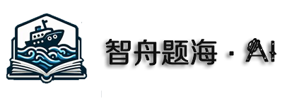

# 智舟题海

ProjectName and Description

<!-- PROJECT SHIELDS -->

[![Contributors][contributors-shield]][contributors-url]
[![Forks][forks-shield]][forks-url]
[![Stargazers][stars-shield]][stars-url]
[![Issues][issues-shield]][issues-url]
[![MIT License][license-shield]][license-url]
[![LinkedIn][linkedin-shield]][linkedin-url]

<!-- PROJECT LOGO -->
<br />

<p align="center">
  <a href="https://github.com/Lichen455/ZTO/blob/main/img/zrx.png">
    
  </a>

  <h3 align="center">智舟题海 - AI</h3>
  <p align="center">
    基于LLM的试题生成器
    <br />
    <a href="https://github.com/shaojintian/Best_README_template"><strong>探索本项目的文档 »</strong></a>
    <br />
    <br />
    <a href="https://github.com/shaojintian/Best_README_template">查看Demo</a>
    ·
    <a href="https://github.com/shaojintian/Best_README_template/issues">报告Bug</a>
    ·
    <a href="https://github.com/shaojintian/Best_README_template/issues">提出新特性</a>
  </p>

</p>


 本篇README.md面向开发者
 
## 目录

- [上手指南](#上手指南)
  - [开发前的配置要求](#开发前的配置要求)
  - [安装步骤](#安装步骤)
- [文件目录说明](#文件目录说明)
- [开发的架构](#开发的架构)
- [部署](#部署)
- [使用到的框架](#使用到的框架)
- [贡献者](#贡献者)
  - [如何参与开源项目](#如何参与开源项目)
- [版本控制](#版本控制)
- [作者](#作者)
- [鸣谢](#鸣谢)

### 上手指南


###### 开发前的配置要求

显存 > 23G

若不满足条件，请考虑量化，或者进行纯API调用

###### **安装步骤**


```sh
git clone https://github.com/shaojintian/Best_README_template.git
```

### 文件目录说明
eg:

```
├── img
└── LLMs
    ├── ChatGLM2-6B
        ├── evaluation
        ├── ptuning
        │   ├── dataset
        │   └── __pycache__
        ├── PTuning_models

```


### 开发的架构 

### 部署

pip install -r requirements.txt

cudnn torch 等建议单独安装

### 使用到的框架


### 贡献者

伟大转圈鸽子

#### 如何参与开源项目

贡献使开源社区成为一个学习、激励和创造的绝佳场所。你所作的任何贡献都是**非常感谢**的。


1. 什么还有人参加这个项目？


### 版本控制

该项目使用Git进行版本管理。您可以在repository参看当前可用版本。

### 作者

黎晨

Q 2425113174   

 *您也可以在贡献者名单中参看所有参与该项目的开发者。*

### 开源协议

Apache License 2.0

### 鸣谢


